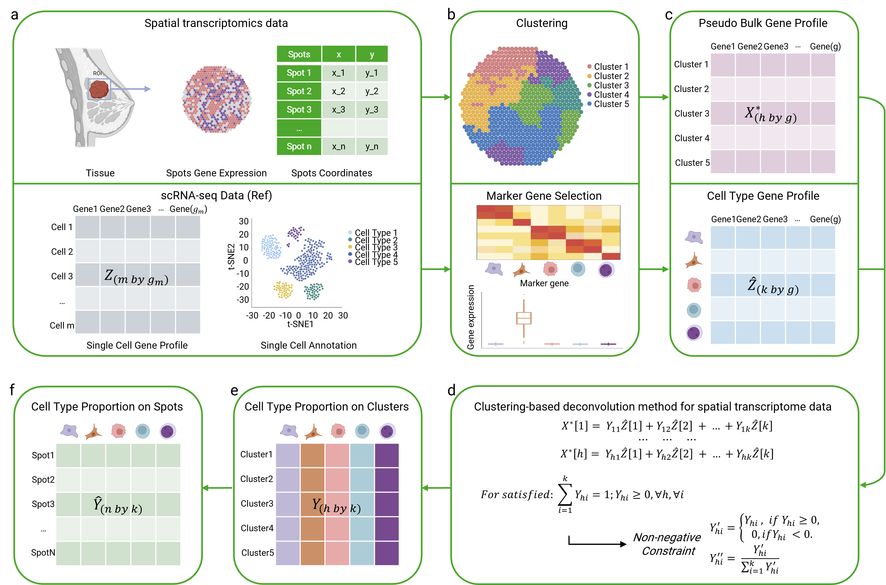

# DECLUST
 A cluster-based cell-type deconvolution of spatial transcriptomic data (DECLUST)

 ## Introduction
 DECLUST, a cluster-based cell-type deconvolution method. DECLUST identifies spatial clusters of spots by integrating both gene expression profiles and spatial coordinates to preserve the spatial structure of the tissue. Deconvolution is then applied to the aggregated gene expression within each cluster, which overcomes the problem of low expression levels in individual spots.
 
 

## Installation

To install DECLUST, follow the steps below:

1. **Clone the Repository**  
   First, clone the repository to your local machine using the command:
   
   ```bash
   git clone https://github.com/Qingyueee/DECLUST.git
   ```
   
   Navigate into the project directory:

   ```bash
   cd DECLUST
   ```

2. **Create and Activate a Virtual Environment** (Optional but recommended)  
   It is recommended to create a virtual environment to manage dependencies. Run the following commands:

   ```bash
   python -m venv venv
   ```

   Activate the virtual environment:

   - On Windows:
     ```bash
     venv\Scripts\activate
     ```
   - On macOS/Linux:
     ```bash
     source venv/bin/activate
     ```

3. **Install Dependencies**  
   Install the required dependencies listed in the `requirements.txt` file:

   ```bash
   pip install -r requirements.txt
   ```

4. **Install DECLUST**  
   In the root directory of the project, run the following command to install DECLUST in editable mode:

   ```bash
   pip install -e .
   ```

5. **Test the Installation**  
   To verify the installation, run the command-line tool:

   ```bash
   declust
   ```

   If the installation is successful, you should see usage instructions or other relevant output.

## Usage

To run DECLUST, follow these steps:

1. **Preprocess Data Using `data_processing.py`**  
   The first step is to preprocess the single-cell and spatial transcriptomics data using the `data_processing.py` script located in the `scripts` folder. This script selects the highly variable genes that overlap between the scRNA-seq data and the spatial transcriptomics data, and it also creates a file containing cell type information for subsequent analysis. 

   Run the script with the following command in the root directory of the project:

   ```bash
   python scripts/data_processing.py
   ```

   This script performs the following tasks:
   
   - Reads the spatial transcriptomics data (`st_adata.h5ad`) and the single-cell RNA-seq data (`sc_adata.h5ad`) from the `data` folder.
   - Selects the top 5000 highly variable genes from each dataset and identifies the common genes between them.
   - Saves the overlapping high-variable genes from the scRNA-seq data to a file: `sc_adata_high_variable_genes.csv` in the `data` folder.
   - Extracts cell type labels and patient sample information from the scRNA-seq data, formatting and saving them into `sc_labels.csv` in the `data` folder.

   Make sure the required files (`st_adata.h5ad` and `sc_adata.h5ad`) are already present in the `data` folder as per the [Example Data Download](#example-data-download) section.

2. **Select Marker Genes Using `cal_statistic.R`**  
   After identifying the overlapping high-variable genes, the next step is to select marker genes from these genes using the `cal_statistic.R` script located in the `scripts` folder. This step involves statistical analysis to identify genes that are specific to each cell type.

   To run the script, use the following command in the root directory of the project:

   ```bash
   Rscript scripts/cal_statistic.R
   ```

   This script performs the following tasks:

   - Reads the file `sc_adata_high_variable_genes.csv` generated from the previous step, as well as the cell type labels from `sc_labels.csv`.
   - Applies statistical tests to identify marker genes for each cell type based on the high-variable genes selected.
   - Saves the resulting marker genes into a file named `marker_genes.csv` in the `data` folder for subsequent deconvolution analysis.

   Ensure that `sc_adata_high_variable_genes.csv` and `sc_labels.csv` are correctly generated and located in the `data` folder before running this step.

3. **Run the DECLUST Pipeline**  
   Once the preprocessing and marker gene selection steps are complete, you can run the DECLUST pipeline to perform cell-type deconvolution on the spatial transcriptomics data. 

   Use the following command to execute the pipeline:

   ```bash
   declust --st_adata data/st_adata.h5ad --sc_adata data/sc_adata.h5ad --marker_genes data/marker_genes.csv
   ```

   This command will:
   
   - Take the spatial transcriptomics data (`st_adata.h5ad`), the single-cell RNA-seq data (`sc_adata.h5ad`), and the marker genes file (`marker_genes.csv`) as inputs.
   - Perform clustering and deconvolution on the spatial transcriptomics data, leveraging the information from the single-cell RNA-seq data and the marker genes.

   **Optional**: If you want to visualize the results of the DBSCAN clustering step during the pipeline execution, use the `--visualize` option:

   ```bash
   declust --st_adata data/st_adata.h5ad --sc_adata data/sc_adata.h5ad --marker_genes data/marker_genes.csv --visualize
   ```

   This will provide a visualization of the DBSCAN clustering process, allowing you to inspect the intermediate clustering results.

## Input Files

DECLUST requires several two files for processing and analysis. Ensure these files are located in the `data` folder as specified:

1. **sc_adata.h5ad**  
   This file contains the single-cell RNA-seq (scRNA-seq) data. It is used to identify highly variable genes and to extract cell type information for marker gene selection. The file should be placed in the `data` folder in the root directory of the project.

2. **st_adata.h5ad**  
   This file contains the spatial transcriptomics (ST) data. It is used for clustering and deconvolution analysis to preserve the spatial structure of the tissue. The file should be placed in the `data` folder in the root directory of the project.


## Example Data Download

Due to the large file size, please manually download the `data.zip` file following these steps:

1. Visit the following link to download the data file:
   [Download data.zip from Google Drive](https://drive.google.com/uc?export=download&id=1LrSQYf1_IqQzxx7GeJrbBsEyuLLHHERC)

2. After downloading, extract the `data.zip` file into the `data` folder located in the root directory of the project. Follow these steps:

   - Create a folder named `data` in the root directory of the project:
   - Extract the downloaded `data.zip` file into the `data` folder.

3. Ensure that the `data` folder contains the extracted contents. These files will be used in subsequent data analysis steps.

## License

GNU General Public License v3.0